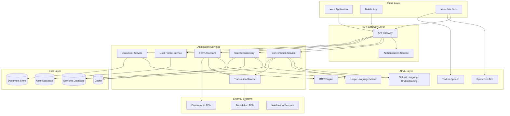

# Design Document: AI-Powered Multilingual Public Services Access Assistant

## Overview

The AI-Powered Multilingual Public Services Access Assistant is a comprehensive system designed to break down barriers preventing citizens from accessing essential government services. The system addresses language barriers, complexity, accessibility gaps, and digital literacy challenges through an intelligent, multilingual, and accessible interface.

### Design Philosophy

The design follows these core principles:

1. **Accessibility First**: Every component must be accessible to users with disabilities, following WCAG 2.1 Level AA standards
2. **Language Agnostic**: All components must support multilingual operation without architectural changes
3. **Progressive Enhancement**: Core functionality works on basic devices, with enhanced features for capable devices
4. **Privacy by Design**: Minimize data collection, encrypt sensitive information, and provide user control
5. **Graceful Degradation**: System remains functional even when individual services fail
6. **Modular Architecture**: Components are loosely coupled to enable independent scaling and updates

### System Context

The system operates within a complex ecosystem:
- **Users**: Citizens with varying language skills, digital literacy, and accessibility needs
- **Government Systems**: Legacy databases, form processing systems, and service catalogs
- **External Services**: Translation APIs, speech recognition, OCR services
- **Administrative Users**: Government staff managing content and monitoring system health

---

## Architecture

### High-Level Architecture

The system follows a microservices architecture with clear separation of concerns:



### Architectural Patterns

**1. API Gateway Pattern**
- Single entry point for all client requests
- Handles authentication, rate limiting, and routing
- Provides protocol translation (HTTP, WebSocket, gRPC)

**2. Service Mesh**
- Service-to-service communication managed by mesh layer
- Built-in retry logic, circuit breakers, and load balancing
- Distributed tracing for debugging

**3. Event-Driven Architecture**
- Asynchronous communication for non-critical operations
- Event bus for service notifications (application submitted, status changed)
- Enables audit logging and analytics

**4. CQRS (Command Query Responsibility Segregation)**
- Separate read and write models for user profiles and applications
- Optimized read models for fast queries
- Write models ensure data consistency

**5. Cache-Aside Pattern**
- Frequently accessed data cached (service information, translations)
- Cache invalidation on updates
- Reduces database load and improves response times

---

## Components and Interfaces

### 1. Conversation Service

**Responsibility**: Manages conversational interactions between users and the AI assistant.

**Key Functions**:
- Maintain conversation context and history
- Route queries to appropriate services
- Generate contextually appropriate responses
- Handle multi-turn conversations

**Interfaces**:

```typescript
interface ConversationService {
  // Start a new conversation session
  startConversation(userId: string, language: string): ConversationSession;
  
  // Process user message and generate response
  processMessage(
    sessionId: string,
    message: UserMessage
  ): Promise<AssistantResponse>;
  
  // Get conversation history
  getHistory(sessionId: string): ConversationHistory;
  
  // End conversation and cleanup
  endConversation(sessionId: string): void;
}

interface UserMessage {
  text: string;
  language: string;
  timestamp: Date;
  metadata?: {
    voiceInput?: boolean;
    location?: GeoLocation;
  };
}

interface AssistantResponse {
  text: string;
  language: string;
  intent: Intent;
  suggestedActions?: Action[];
  relatedServices?: ServiceSummary[];
}

interface ConversationSession {
  sessionId: string;
  userId: string;
  language: string;
  context: ConversationContext;
  startTime: Date;
}

interface ConversationContext {
  currentTopic?: string;
  userProfile?: UserProfile;
  recentServices?: string[];
  formInProgress?: string;
}
```

**Dependencies**:
- Natural Language Understanding Service
- Large Language Model Service
- Translation Service
- User Profile Service

### 2. Translation Service

**Responsibility**: Provides real-time translation across all supported languages.

**Key Functions**:
- Translate text between any supported language pair
- Detect source language automatically
- Cache common translations
- Handle cultural context and idioms

**Interfaces**:

```typescript
interface TranslationService {
  // Translate text from source to target language
  translate(
    text: string,
    targetLanguage: string,
    sourceLanguage?: string
  ): Promise<Translation>;
  
  // Detect language of text
  detectLanguage(text: string): Promise<LanguageDetection>;
  
  // Batch translate multiple texts
  translateBatch(
    texts: string[],
    targetLanguage: string,
    sourceLanguage?: string
  ): Promise<Translation[]>;
  
  // Get supported languages
  getSupportedLanguages(): Language[];
}

interface Translation {
  originalText: string;
  translatedText: string;
  sourceLanguage: string;
  targetLanguage: string;
  confidence: number;
}

interface LanguageDetection {
  language: string;
  confidence: number;
  alternatives?: Array<{language: string; confidence: number}>;
}

interface Language {
  code: string; // ISO 639-1 code
  name: string;
  nativeName: string;
  rtl: boolean; // Right-to-left script
}
```

**Dependencies**:
- External Translation API (Google Translate, DeepL, or custom NMT)
- Cache Service

### 3. Service Discovery Service

**Responsibility**: Helps users find relevant government services based on their needs and eligibility.

**Key Functions**:
- Parse natural language queries to understand user needs
- Match users to eligible services
- Rank services by relevance
- Filter by location and availability

**Interfaces**:

```typescript
interface ServiceDiscoveryService {
  // Search for services based on natural language query
  searchServices(
    query: string,
    userProfile: UserProfile,
    filters?: ServiceFilters
  ): Promise<ServiceSearchResult[]>;
  
  // Get detailed information about a specific service
  getServiceDetails(serviceId: string, language: string): Promise<ServiceDetails>;
  
  // Check user eligibility for a service
  checkEligibility(
    serviceId: string,
    userProfile: UserProfile
  ): Promise<EligibilityResult>;
  
  // Get service categories
  getCategories(language: string): Promise<ServiceCategory[]>;
}

interface ServiceSearchResult {
  serviceId: string;
  name: string;
  description: string;
  category: string;
  eligibilityScore: number; // 0-100
  relevanceScore: number; // 0-100
  provider: string;
  location?: string;
}

interface ServiceDetails {
  serviceId: string;
  name: string;
  description: string;
  longDescription: string;
  category: string;
  provider: string;
  eligibilityRequirements: Requirement[];
  applicationProcess: ProcessStep[];
  requiredDocuments: Document[];
  estimatedProcessingTime: string;
  contactInformation: ContactInfo;
  officialLinks: string[];
}

interface EligibilityResult {
  eligible: boolean;
  confidence: number;
  matchedRequirements: Requirement[];
  missingRequirements: Requirement[];
  explanation: string;
}

interface ServiceFilters {
  categories?: string[];
  location?: GeoLocation;
  maxProcessingTime?: number;
  requiresDocuments?: boolean;
}
```

**Dependencies**:
- Services Database
- Natural Language Understanding Service
- User Profile Service
- Cache Service

### 4. Form Assistant Service

**Responsibility**: Guides users through completing government forms with validation and assistance.

**Key Functions**:
- Provide step-by-step form guidance
- Validate field inputs in real-time
- Auto-fill from user profile or uploaded documents
- Save progress and enable resume
- Pre-submission validation

**Interfaces**:

```typescript
interface FormAssistantService {
  // Start a new form session
  startForm(
    userId: string,
    serviceId: string,
    language: string
  ): Promise<FormSession>;
  
  // Get form structure and current progress
  getFormState(sessionId: string): Promise<FormState>;
  
  // Update a form field
  updateField(
    sessionId: string,
    fieldId: string,
    value: any
  ): Promise<FieldValidationResult>;
  
  // Auto-fill form from user profile or document
  autoFill(
    sessionId: string,
    source: 'profile' | 'document',
    documentId?: string
  ): Promise<AutoFillResult>;
  
  // Validate entire form before submission
  validateForm(sessionId: string): Promise<FormValidationResult>;
  
  // Submit completed form
  submitForm(sessionId: string): Promise<SubmissionResult>;
  
  // Save progress and resume later
  saveProgress(sessionId: string): Promise<void>;
  resumeForm(sessionId: string): Promise<FormState>;
}

interface FormSession {
  sessionId: string;
  userId: string;
  serviceId: string;
  language: string;
  startTime: Date;
  lastUpdated: Date;
}

interface FormState {
  sessionId: string;
  formDefinition: FormDefinition;
  currentStep: number;
  totalSteps: number;
  fieldValues: Record<string, any>;
  completedFields: string[];
  errors: Record<string, string>;
  progress: number; // 0-100
}

interface FormDefinition {
  formId: string;
  title: string;
  description: string;
  steps: FormStep[];
}

interface FormStep {
  stepId: string;
  title: string;
  description: string;
  fields: FormField[];
}

interface FormField {
  fieldId: string;
  label: string;
  type: FieldType;
  required: boolean;
  helpText?: string;
  validation?: ValidationRule[];
  options?: FieldOption[]; // For select/radio fields
  placeholder?: string;
}

type FieldType = 
  | 'text' 
  | 'number' 
  | 'date' 
  | 'email' 
  | 'phone' 
  | 'select' 
  | 'radio' 
  | 'checkbox' 
  | 'textarea' 
  | 'file';

interface FieldValidationResult {
  valid: boolean;
  errors?: string[];
  warnings?: string[];
  suggestions?: string[];
}

interface FormValidationResult {
  valid: boolean;
  errors: Record<string, string[]>;
  warnings: Record<string, string[]>;
  missingRequired: string[];
}

interface SubmissionResult {
  success: boolean;
  applicationId?: string;
  confirmationNumber?: string;
  estimatedProcessingTime?: string;
  nextSteps?: string[];
  errors?: string[];
}
```

**Dependencies**:
- Services Database (form definitions)
- User Profile Service
- Document Service (for auto-fill)
- Government APIs (for submission)
- Translation Service

### 5. User Profile Service

**Responsibility**: Manages user accounts, profiles, and preferences.

**Key Functions**:
- User registration and authentication
- Store and retrieve user profile information
- Manage user preferences (language, accessibility)
- Track application history
- Secure document vault

**Interfaces**:

```typescript
interface UserProfileService {
  // User registration and authentication
  register(userData: UserRegistration): Promise<User>;
  authenticate(credentials: Credentials): Promise<AuthToken>;
  logout(userId: string): Promise<void>;
  
  // Profile management
  getProfile(userId: string): Promise<UserProfile>;
  updateProfile(userId: string, updates: Partial<UserProfile>): Promise<UserProfile>;
  deleteProfile(userId: string): Promise<void>;
  
  // Preferences
  getPreferences(userId: string): Promise<UserPreferences>;
  updatePreferences(userId: string, preferences: Partial<UserPreferences>): Promise<void>;
  
  // Application history
  getApplicationHistory(userId: string): Promise<Application[]>;
  getApplicationStatus(applicationId: string): Promise<ApplicationStatus>;
}

interface UserRegistration {
  email: string;
  password: string;
  preferredLanguage: string;
  acceptedTerms: boolean;
}

interface User {
  userId: string;
  email: string;
  createdAt: Date;
  lastLogin: Date;
}

interface UserProfile {
  userId: string;
  demographics: {
    age?: number;
    householdSize?: number;
    location?: GeoLocation;
    income?: IncomeRange;
    employmentStatus?: string;
    citizenship?: string;
  };
  contactInfo: {
    phone?: string;
    address?: Address;
    preferredContactMethod?: 'email' | 'phone' | 'sms';
  };
}

interface UserPreferences {
  language: string;
  accessibility: {
    screenReader: boolean;
    highContrast: boolean;
    fontSize: 'small' | 'medium' | 'large' | 'xlarge';
    keyboardOnly: boolean;
    simpleLanguage: boolean;
  };
  notifications: {
    email: boolean;
    sms: boolean;
    push: boolean;
  };
}

interface Application {
  applicationId: string;
  serviceId: string;
  serviceName: string;
  submittedAt: Date;
  status: ApplicationStatus;
  lastUpdated: Date;
}

type ApplicationStatus = 
  | 'draft' 
  | 'submitted' 
  | 'under_review' 
  | 'approved' 
  | 'rejected' 
  | 'requires_action';
```

**Dependencies**:
- User Database
- Authentication Service (OAuth, JWT)
- Encryption Service

### 6. Document Service

**Responsibility**: Handles document upload, storage, OCR, and retrieval.

**Key Functions**:
- Upload and store documents securely
- Extract text from documents using OCR
- Parse structured data from documents
- Manage document lifecycle
- Provide secure access to documents

**Interfaces**:

```typescript
interface DocumentService {
  // Upload document
  uploadDocument(
    userId: string,
    file: File,
    metadata: DocumentMetadata
  ): Promise<Document>;
  
  // Process document with OCR
  processDocument(documentId: string): Promise<OCRResult>;
  
  // Extract structured data from document
  extractData(
    documentId: string,
    dataType: DocumentType
  ): Promise<ExtractedData>;
  
  // Retrieve document
  getDocument(documentId: string, userId: string): Promise<Document>;
  
  // List user's documents
  listDocuments(userId: string): Promise<Document[]>;
  
  // Delete document
  deleteDocument(documentId: string, userId: string): Promise<void>;
}

interface DocumentMetadata {
  name: string;
  type: DocumentType;
  description?: string;
}

type DocumentType = 
  | 'id_card' 
  | 'passport' 
  | 'birth_certificate' 
  | 'proof_of_income' 
  | 'proof_of_address' 
  | 'other';

interface Document {
  documentId: string;
  userId: string;
  name: string;
  type: DocumentType;
  uploadedAt: Date;
  size: number;
  mimeType: string;
  url: string; // Secure, time-limited URL
  ocrProcessed: boolean;
}

interface OCRResult {
  documentId: string;
  text: string;
  confidence: number;
  language: string;
  pages: OCRPage[];
}

interface OCRPage {
  pageNumber: number;
  text: string;
  confidence: number;
  blocks: TextBlock[];
}

interface TextBlock {
  text: string;
  confidence: number;
  boundingBox: BoundingBox;
}

interface ExtractedData {
  documentId: string;
  dataType: DocumentType;
  fields: Record<string, any>;
  confidence: number;
}
```

**Dependencies**:
- Document Store (S3, Azure Blob Storage)
- OCR Engine (Tesseract, Google Vision API)
- Encryption Service

### 7. Voice Interface Service

**Responsibility**: Enables voice-based interaction with the system.

**Key Functions**:
- Convert speech to text
- Convert text to speech
- Handle voice commands
- Provide voice feedback

**Interfaces**:

```typescript
interface VoiceInterfaceService {
  // Convert speech to text
  speechToText(
    audioData: AudioStream,
    language: string
  ): Promise<SpeechRecognitionResult>;
  
  // Convert text to speech
  textToSpeech(
    text: string,
    language: string,
    voice?: VoiceOptions
  ): Promise<AudioStream>;
  
  // Process voice command
  processVoiceCommand(
    command: string,
    context: ConversationContext
  ): Promise<CommandResult>;
}

interface SpeechRecognitionResult {
  text: string;
  confidence: number;
  language: string;
  alternatives?: Array<{text: string; confidence: number}>;
}

interface VoiceOptions {
  gender?: 'male' | 'female';
  speed?: number; // 0.5 to 2.0
  pitch?: number; // 0.5 to 2.0
}

interface AudioStream {
  data: Buffer;
  format: 'mp3' | 'wav' | 'ogg';
  duration: number;
}

interface CommandResult {
  understood: boolean;
  action: string;
  parameters: Record<string, any>;
  response: string;
}
```

**Dependencies**:
- Speech-to-Text Service (Google Speech API, Azure Speech)
- Text-to-Speech Service
- Conversation Service

### 8. Administrative Dashboard Service

**Responsibility**: Provides tools for administrators to manage content and monitor system health.

**Key Functions**:
- Manage service catalog
- View usage analytics
- Monitor system health
- Review user feedback
- Manage translations

**Interfaces**:

```typescript
interface AdminDashboardService {
  // Service management
  createService(service: ServiceDefinition): Promise<string>;
  updateService(serviceId: string, updates: Partial<ServiceDefinition>): Promise<void>;
  deleteService(serviceId: string): Promise<void>;
  
  // Analytics
  getUsageMetrics(timeRange: TimeRange): Promise<UsageMetrics>;
  getUserSatisfaction(timeRange: TimeRange): Promise<SatisfactionMetrics>;
  getPopularServices(limit: number): Promise<ServiceStats[]>;
  
  // System health
  getSystemHealth(): Promise<HealthStatus>;
  getServiceStatus(): Promise<ServiceStatus[]>;
  
  // Feedback management
  getUserFeedback(filters: FeedbackFilters): Promise<Feedback[]>;
  respondToFeedback(feedbackId: string, response: string): Promise<void>;
}

interface UsageMetrics {
  totalUsers: number;
  activeUsers: number;
  totalSessions: number;
  averageSessionDuration: number;
  queriesPerSession: number;
  topLanguages: Array<{language: string; count: number}>;
  topServices: Array<{serviceId: string; count: number}>;
}

interface SatisfactionMetrics {
  averageRating: number;
  nps: number;
  satisfactionByService: Record<string, number>;
  commonIssues: Array<{issue: string; count: number}>;
}

interface HealthStatus {
  overall: 'healthy' | 'degraded' | 'down';
  services: ServiceStatus[];
  uptime: number;
  lastIncident?: Date;
}

interface ServiceStatus {
  serviceName: string;
  status: 'up' | 'down' | 'degraded';
  responseTime: number;
  errorRate: number;
  lastChecked: Date;
}
```

**Dependencies**:
- Services Database
- Analytics Database
- Monitoring Service

---

## Data Models

### User Data Model

```typescript
interface User {
  userId: string; // UUID
  email: string; // Unique, encrypted
  passwordHash: string; // Bcrypt hash
  createdAt: Date;
  lastLogin: Date;
  emailVerified: boolean;
  mfaEnabled: boolean;
  status: 'active' | 'suspended' | 'deleted';
}

interface UserProfile {
  userId: string; // Foreign key to User
  demographics: Demographics;
  contactInfo: ContactInfo;
  updatedAt: Date;
}

interface Demographics {
  age?: number; // Optional, for eligibility
  dateOfBirth?: Date; // Encrypted
  householdSize?: number;
  location?: GeoLocation;
  income?: IncomeRange;
  employmentStatus?: EmploymentStatus;
  citizenship?: string;
  veteranStatus?: boolean;
  disabilityStatus?: boolean;
}

interface ContactInfo {
  phone?: string; // Encrypted
  address?: Address; // Encrypted
  preferredContactMethod?: ContactMethod;
}

interface Address {
  street: string;
  city: string;
  state: string;
  zipCode: string;
  country: string;
}

type IncomeRange = 
  | 'under_25k' 
  | '25k_50k' 
  | '50k_75k' 
  | '75k_100k' 
  | 'over_100k';

type EmploymentStatus = 
  | 'employed' 
  | 'unemployed' 
  | 'self_employed' 
  | 'retired' 
  | 'student';

type ContactMethod = 'email' | 'phone' | 'sms' | 'mail';
```

### Service Data Model

```typescript
interface Service {
  serviceId: string; // UUID
  name: Record<string, string>; // Multilingual: {en: "...", es: "..."}
  description: Record<string, string>; // Multilingual
  longDescription: Record<string, string>; // Multilingual
  category: ServiceCategory;
  provider: string; // Government agency name
  eligibilityRequirements: Requirement[];
  applicationProcess: ProcessStep[];
  requiredDocuments: DocumentRequirement[];
  estimatedProcessingTime: string;
  contactInformation: ContactInfo;
  officialLinks: Record<string, string>; // Multilingual URLs
  active: boolean;
  createdAt: Date;
  updatedAt: Date;
}

interface Requirement {
  requirementId: string;
  description: Record<string, string>; // Multilingual
  type: RequirementType;
  condition: EligibilityCondition;
  mandatory: boolean;
}

type RequirementType = 
  | 'age' 
  | 'income' 
  | 'residency' 
  | 'citizenship' 
  | 'employment' 
  | 'household_size' 
  | 'disability' 
  | 'veteran_status';

interface EligibilityCondition {
  field: string;
  operator: 'eq' | 'ne' | 'gt' | 'lt' | 'gte' | 'lte' | 'in' | 'between';
  value: any;
}

interface ProcessStep {
  stepNumber: number;
  title: Record<string, string>; // Multilingual
  description: Record<string, string>; // Multilingual
  estimatedTime: string;
}

interface DocumentRequirement {
  documentType: DocumentType;
  description: Record<string, string>; // Multilingual
  required: boolean;
  alternatives?: DocumentType[];
}

type ServiceCategory = 
  | 'healthcare' 
  | 'housing' 
  | 'education' 
  | 'employment' 
  | 'legal' 
  | 'financial' 
  | 'food_assistance' 
  | 'childcare' 
  | 'transportation' 
  | 'disability_services';
```

### Application Data Model

```typescript
interface Application {
  applicationId: string; // UUID
  userId: string; // Foreign key
  serviceId: string; // Foreign key
  status: ApplicationStatus;
  formData: Record<string, any>; // Encrypted
  attachedDocuments: string[]; // Document IDs
  submittedAt?: Date;
  lastUpdated: Date;
  statusHistory: StatusChange[];
  confirmationNumber?: string;
}

type ApplicationStatus = 
  | 'draft' 
  | 'submitted' 
  | 'under_review' 
  | 'requires_action' 
  | 'approved' 
  | 'rejected' 
  | 'withdrawn';

interface StatusChange {
  status: ApplicationStatus;
  timestamp: Date;
  reason?: string;
  updatedBy?: string; // System or admin ID
}
```

### Conversation Data Model

```typescript
interface Conversation {
  conversationId: string; // UUID
  userId: string; // Foreign key
  language: string;
  startTime: Date;
  endTime?: Date;
  messages: Message[];
  context: ConversationContext;
}

interface Message {
  messageId: string;
  role: 'user' | 'assistant' | 'system';
  content: string;
  timestamp: Date;
  metadata?: {
    intent?: string;
    confidence?: number;
    voiceInput?: boolean;
  };
}

interface ConversationContext {
  currentTopic?: string;
  mentionedServices?: string[];
  formInProgress?: string;
  lastIntent?: string;
}
```

### Document Data Model

```typescript
interface StoredDocument {
  documentId: string; // UUID
  userId: string; // Foreign key
  name: string;
  type: DocumentType;
  mimeType: string;
  size: number;
  storageKey: string; // S3 key or blob path
  uploadedAt: Date;
  expiresAt?: Date; // Optional expiration
  encrypted: boolean;
  ocrProcessed: boolean;
  ocrText?: string;
  extractedData?: Record<string, any>;
  metadata: DocumentMetadata;
}
```

### Analytics Data Model

```typescript
interface SessionAnalytics {
  sessionId: string;
  userId?: string; // Optional for anonymous sessions
  startTime: Date;
  endTime?: Date;
  duration?: number; // seconds
  language: string;
  device: DeviceInfo;
  location?: GeoLocation;
  queriesCount: number;
  servicesViewed: string[];
  formsStarted: string[];
  formsCompleted: string[];
  satisfactionRating?: number;
}

interface DeviceInfo {
  type: 'desktop' | 'mobile' | 'tablet';
  os: string;
  browser: string;
  screenSize: string;
}

interface GeoLocation {
  latitude: number;
  longitude: number;
  city?: string;
  state?: string;
  country: string;
}
```

---


# Security Architecture

## 1. Security Principles

### 1.1 Core Principles
- **Zero Trust**: Never trust, always verify
- **Defense in Depth**: Multiple layers of security
- **Least Privilege**: Minimum necessary access
- **Secure by Default**: Security built-in, not bolted-on
- **Privacy by Design**: Data protection from the start
- **Fail Securely**: Graceful degradation without exposing data

---

## 2. Authentication & Authorization

### 2.1 User Authentication

#### Multi-Factor Authentication (MFA)
```
Primary Factor: Password (bcrypt, cost 12)
Secondary Factor: 
  - TOTP (Time-based One-Time Password)
  - SMS code (fallback)
  - Email verification link
  - Biometric (mobile app)
```

#### Password Policy
- Minimum 12 characters
- Mix of uppercase, lowercase, numbers, symbols
- No common passwords (check against breach database)
- Password history: prevent reuse of last 5 passwords
- Expiration: Optional (NIST recommends against forced rotation)

#### Session Management
- JWT tokens with RS256 signing
- Access token: 15-minute expiration
- Refresh token: 7-day expiration, rotation on use
- Secure, HttpOnly, SameSite=Strict cookies
- Session invalidation on logout
- Concurrent session limit: 3 devices

### 2.2 Authorization

#### Role-Based Access Control (RBAC)
```
Roles:
- citizen: Standard user
- social_worker: Can assist multiple users
- content_admin: Manage service information
- system_admin: Full system access
- auditor: Read-only access to logs

Permissions:
- read:own_profile
- write:own_profile
- read:services
- apply:services
- upload:documents
- manage:content
- view:analytics
- manage:users
```

#### API Authorization
```javascript
// Example middleware
const authorize = (requiredPermissions) => {
  return async (req, res, next) => {
    const token = extractToken(req);
    const user = await verifyToken(token);
    
    if (!hasPermissions(user, requiredPermissions)) {
      return res.status(403).json({ error: 'Forbidden' });
    }
    
    req.user = user;
    next();
  };
};

// Usage
app.get('/api/v1/admin/users', 
  authorize(['manage:users']), 
  getUsersHandler
);
```

---

## 3. Data Security

### 3.1 Encryption

#### Data at Rest
- **Database**: AES-256 encryption
- **Documents**: AES-256 before S3 upload
- **Backups**: Encrypted with separate keys
- **Logs**: PII redacted, encrypted storage

#### Data in Transit
- **TLS 1.3**: All external communication
- **mTLS**: Inter-service communication
- **Certificate Pinning**: Mobile apps
- **HSTS**: Strict-Transport-Security header

#### Key Management
- **KMS**: AWS KMS or HashiCorp Vault
- **Key Rotation**: Automatic every 90 days
- **Key Hierarchy**: Master key → Data encryption keys
- **Access Control**: IAM policies for key usage

### 3.2 Sensitive Data Handling

#### PII Protection
```
Sensitive Fields:
- SSN: Encrypted, masked in UI (XXX-XX-1234)
- Date of Birth: Encrypted
- Address: Encrypted
- Income: Encrypted
- Documents: Encrypted, access-controlled

Non-Sensitive (can be indexed):
- User ID (UUID)
- Language preference
- Service categories viewed
- Application status
```

#### Data Minimization
- Collect only necessary information
- Anonymize analytics data
- Aggregate statistics, no individual tracking
- Regular data purging (inactive accounts after 2 years)

#### Right to Erasure (GDPR)
```
User requests deletion:
1. Soft delete: Mark account as deleted
2. Anonymize: Replace PII with random data
3. Retain: Keep anonymized data for legal compliance (7 years)
4. Hard delete: Remove all data after retention period
5. Notify: Confirm deletion to user
```

---

## 4. Network Security

### 4.1 Perimeter Security

#### Web Application Firewall (WAF)
- **Rules**: OWASP Top 10 protection
- **Rate Limiting**: IP-based, user-based
- **Geo-blocking**: Optional country restrictions
- **Bot Protection**: CAPTCHA for suspicious activity

#### DDoS Protection
- **Layer 3/4**: AWS Shield, Cloudflare
- **Layer 7**: WAF rate limiting
- **Auto-scaling**: Absorb traffic spikes

### 4.2 Network Segmentation

```
┌─────────────────────────────────────────┐
│         Public Subnet (DMZ)             │
│  - Load Balancer                        │
│  - API Gateway                          │
│  - WAF                                  │
└─────────────┬───────────────────────────┘
              │
┌─────────────▼───────────────────────────┐
│       Private Subnet (App Tier)         │
│  - Microservices (ECS/K8s)              │
│  - No direct internet access            │
│  - NAT Gateway for outbound             │
└─────────────┬───────────────────────────┘
              │
┌─────────────▼───────────────────────────┐
│      Private Subnet (Data Tier)         │
│  - PostgreSQL, MongoDB, Redis           │
│  - No internet access                   │
│  - VPC Endpoints for AWS services       │
└─────────────────────────────────────────┘
```

### 4.3 API Security

#### Rate Limiting
```
Anonymous: 100 requests/hour
Authenticated: 1,000 requests/hour
Premium: 10,000 requests/hour

Per Endpoint:
- /api/v1/translate: 500 requests/hour
- /api/v1/voice/stt: 100 requests/hour
- /api/v1/services/search: 200 requests/hour
```

#### Input Validation
- **Schema Validation**: Joi, Pydantic
- **SQL Injection**: Parameterized queries, ORM
- **XSS**: Content Security Policy, input sanitization
- **CSRF**: SameSite cookies, CSRF tokens
- **File Upload**: Type validation, size limits, virus scanning

---

## 5. Application Security

### 5.1 Secure Coding Practices

#### OWASP Top 10 Mitigation

**A01: Broken Access Control**
- Implement RBAC consistently
- Deny by default
- Validate user ownership of resources

**A02: Cryptographic Failures**
- Use strong algorithms (AES-256, RSA-2048)
- Never roll your own crypto
- Secure key storage (KMS)

**A03: Injection**
- Parameterized queries
- Input validation and sanitization
- Principle of least privilege for DB users

**A04: Insecure Design**
- Threat modeling during design
- Security requirements in user stories
- Secure design patterns

**A05: Security Misconfiguration**
- Disable default accounts
- Remove unnecessary features
- Security headers (CSP, X-Frame-Options)

**A06: Vulnerable Components**
- Automated dependency scanning (Snyk, Dependabot)
- Regular updates
- Software Bill of Materials (SBOM)

**A07: Authentication Failures**
- MFA enforcement
- Secure session management
- Account lockout after failed attempts

**A08: Software and Data Integrity**
- Code signing
- Integrity checks for dependencies
- Secure CI/CD pipeline

**A09: Logging and Monitoring Failures**
- Comprehensive audit logging
- Real-time alerting
- Log retention (1 year minimum)

**A10: Server-Side Request Forgery (SSRF)**
- Whitelist allowed domains
- Validate and sanitize URLs
- Network segmentation

### 5.2 Security Headers

```
Content-Security-Policy: default-src 'self'; 
  script-src 'self' 'unsafe-inline' https://cdn.example.com; 
  style-src 'self' 'unsafe-inline'; 
  img-src 'self' data: https:; 
  font-src 'self' data:; 
  connect-src 'self' https://api.example.com;

X-Frame-Options: DENY
X-Content-Type-Options: nosniff
Referrer-Policy: strict-origin-when-cross-origin
Permissions-Policy: geolocation=(self), microphone=(self), camera=(self)
Strict-Transport-Security: max-age=31536000; includeSubDomains; preload
```

---

## 6. Infrastructure Security

### 6.1 Container Security

#### Image Security
- **Base Images**: Official, minimal images (Alpine, Distroless)
- **Scanning**: Trivy, Snyk for vulnerabilities
- **Signing**: Docker Content Trust
- **Registry**: Private registry with access control

#### Runtime Security
- **Non-root User**: Run containers as non-root
- **Read-only Filesystem**: Where possible
- **Resource Limits**: CPU, memory limits
- **Network Policies**: Restrict inter-pod communication

### 6.2 Kubernetes Security

```yaml
# Security Context
securityContext:
  runAsNonRoot: true
  runAsUser: 1000
  readOnlyRootFilesystem: true
  allowPrivilegeEscalation: false
  capabilities:
    drop:
      - ALL

# Network Policy
apiVersion: networking.k8s.io/v1
kind: NetworkPolicy
metadata:
  name: api-service-policy
spec:
  podSelector:
    matchLabels:
      app: api-service
  policyTypes:
    - Ingress
    - Egress
  ingress:
    - from:
        - podSelector:
            matchLabels:
              app: api-gateway
      ports:
        - protocol: TCP
          port: 3000
```

### 6.3 Secrets Management

```
DO NOT:
- Hardcode secrets in code
- Commit secrets to Git
- Store secrets in environment variables (visible in /proc)

DO:
- Use AWS Secrets Manager / HashiCorp Vault
- Inject secrets at runtime
- Rotate secrets regularly
- Audit secret access
```

---

## 7. Monitoring & Incident Response

### 7.1 Security Monitoring

#### Logging
```
Log Events:
- Authentication attempts (success/failure)
- Authorization failures
- Data access (PII)
- Configuration changes
- API errors (4xx, 5xx)
- Suspicious activity (multiple failed logins)

Log Format (JSON):
{
  "timestamp": "2026-02-14T10:30:00Z",
  "level": "WARN",
  "event": "auth.failed_login",
  "user_id": "uuid",
  "ip_address": "192.168.1.1",
  "user_agent": "Mozilla/5.0...",
  "reason": "invalid_password",
  "attempt_count": 3
}
```

#### Alerting
```
Critical Alerts (PagerDuty):
- Multiple failed login attempts (5+ in 5 minutes)
- Unauthorized access attempts
- Data breach indicators
- Service outages
- Certificate expiration (7 days)

Warning Alerts (Slack):
- High error rate (>5%)
- Slow response times (>2s)
- Unusual traffic patterns
- Failed deployments
```

### 7.2 Incident Response

#### Incident Response Plan
```
1. Detection: Automated alerts, user reports
2. Triage: Assess severity (Critical, High, Medium, Low)
3. Containment: Isolate affected systems
4. Investigation: Root cause analysis
5. Eradication: Remove threat, patch vulnerabilities
6. Recovery: Restore services, verify integrity
7. Post-Incident: Document lessons learned, update procedures
```

#### Security Incident Categories
- **Data Breach**: Unauthorized access to PII
- **DDoS Attack**: Service unavailability
- **Malware**: Infected systems
- **Insider Threat**: Malicious employee
- **Phishing**: Social engineering attack

---

## 8. Compliance & Auditing

### 8.1 Compliance Requirements

#### GDPR (General Data Protection Regulation)
- **Lawful Basis**: User consent, legitimate interest
- **Data Minimization**: Collect only necessary data
- **Right to Access**: Users can download their data
- **Right to Erasure**: Users can delete their account
- **Data Portability**: Export data in machine-readable format
- **Breach Notification**: Within 72 hours

#### HIPAA (if handling health data)
- **Access Controls**: Role-based access
- **Audit Logs**: Track all PHI access
- **Encryption**: At rest and in transit
- **Business Associate Agreements**: With third parties

#### Section 508 (Accessibility)
- **WCAG 2.1 Level AA**: Compliance verified
- **Keyboard Navigation**: Full functionality
- **Screen Reader**: Compatible

### 8.2 Audit Logging

```sql
CREATE TABLE audit_logs (
  id UUID PRIMARY KEY,
  timestamp TIMESTAMP NOT NULL,
  user_id UUID,
  action VARCHAR(100) NOT NULL,
  resource_type VARCHAR(50),
  resource_id UUID,
  ip_address INET,
  user_agent TEXT,
  changes JSONB,
  result VARCHAR(20) -- success, failure, denied
);

-- Example audit log entry
INSERT INTO audit_logs VALUES (
  gen_random_uuid(),
  NOW(),
  'user-uuid',
  'profile.update',
  'user_profile',
  'profile-uuid',
  '192.168.1.1',
  'Mozilla/5.0...',
  '{"field": "email", "old": "old@example.com", "new": "new@example.com"}',
  'success'
);
```

### 8.3 Regular Security Audits

#### Internal Audits (Quarterly)
- Code review for security issues
- Dependency vulnerability scan
- Access control review
- Log analysis for anomalies

#### External Audits (Annual)
- Penetration testing
- SOC 2 Type II audit
- WCAG compliance audit
- Third-party security assessment

---

## 9. Third-Party Security

### 9.1 Vendor Risk Management

#### Vendor Assessment
- **Security Certifications**: SOC 2, ISO 27001
- **Data Handling**: Where is data stored? Encrypted?
- **Incident Response**: Do they have a plan?
- **SLA**: Uptime guarantees, support response times
- **Compliance**: GDPR, HIPAA compliant?

#### Contracts
- **Data Processing Agreement (DPA)**: GDPR requirement
- **Business Associate Agreement (BAA)**: HIPAA requirement
- **SLA**: Service level commitments
- **Liability**: Who is responsible for breaches?

### 9.2 API Security (External Integrations)

```
Government API Integration:
- mTLS: Mutual TLS authentication
- API Keys: Stored in Secrets Manager
- Rate Limiting: Respect their limits
- Retry Logic: Exponential backoff
- Circuit Breaker: Fail fast if API is down
- Logging: Log all requests/responses (redact PII)
```

---

## 10. Disaster Recovery & Business Continuity

### 10.1 Backup Strategy

```
Database Backups:
- Frequency: Every 6 hours
- Retention: 30 days
- Encryption: AES-256
- Testing: Monthly restore test
- Location: Cross-region replication

Document Backups:
- Frequency: Real-time replication
- Retention: Indefinite (user data)
- Encryption: AES-256
- Location: Multi-region S3
```

### 10.2 Disaster Recovery

```
RTO (Recovery Time Objective): 4 hours
RPO (Recovery Point Objective): 1 hour

Failover Plan:
1. Detect outage (automated monitoring)
2. Trigger failover to secondary region
3. Update DNS to point to secondary
4. Verify services are operational
5. Notify users of temporary degradation
6. Investigate root cause
7. Restore primary region
8. Failback when ready
```

---

## 11. Security Testing

### 11.1 Automated Testing

#### Static Application Security Testing (SAST)
- **Tools**: SonarQube, Semgrep, Bandit (Python)
- **Frequency**: Every commit (CI/CD)
- **Fail Build**: On critical vulnerabilities

#### Dynamic Application Security Testing (DAST)
- **Tools**: OWASP ZAP, Burp Suite
- **Frequency**: Weekly on staging
- **Scope**: All API endpoints, web pages

#### Dependency Scanning
- **Tools**: Snyk, Dependabot, npm audit
- **Frequency**: Daily
- **Auto-fix**: Patch minor vulnerabilities automatically

### 11.2 Manual Testing

#### Penetration Testing
- **Frequency**: Annually
- **Scope**: Full application, infrastructure
- **Provider**: Third-party security firm
- **Report**: Detailed findings, remediation plan

#### Code Review
- **Frequency**: Every pull request
- **Focus**: Security-sensitive code (auth, crypto, data access)
- **Checklist**: OWASP guidelines, secure coding standards

---

## 12. Security Training

### 12.1 Developer Training
- **Secure Coding**: OWASP Top 10, common vulnerabilities
- **Threat Modeling**: Identify security risks early
- **Incident Response**: What to do if breach detected
- **Frequency**: Quarterly workshops

### 12.2 User Education
- **Password Security**: Strong passwords, password managers
- **Phishing Awareness**: Recognize suspicious emails
- **MFA**: Importance of two-factor authentication
- **Privacy**: What data we collect, how it's used

---

*This security architecture provides defense-in-depth protection for sensitive user data while maintaining usability and accessibility. Regular reviews and updates are essential as threats evolve.*
## Correctness Properties

*A property is a characteristic or behavior that should hold true across all valid executions of a system—essentially, a formal statement about what the system should do. Properties serve as the bridge between human-readable specifications and machine-verifiable correctness guarantees.*

Before defining the correctness properties, I need to analyze the acceptance criteria from the requirements document to determine which are testable as properties, examples, or edge cases.


### Property Reflection

After analyzing all acceptance criteria, I've identified the following areas where properties can be consolidated:

**Consolidation Opportunities:**

1. **Round-trip properties** (1.4, 3.4, 7.4, 10.4): All involve saving and retrieving data. These share the same pattern but apply to different entities (preferences, forms, conversations, notes), so they should remain separate as they test different components.

2. **Field existence checks** (3.1, 8.4): Both verify that required information is present. These are distinct properties for different domains (forms vs applications).

3. **Access control properties** (4.4, 9.5, 10.5): All test authorization. These can be consolidated into a single comprehensive access control property that covers documents, admin functions, and client data.

4. **UI element properties** (1.2, 5.2): Both verify that UI elements have required attributes (translations, ARIA labels). These test different aspects and should remain separate.

5. **Real-time updates** (3.2, 8.2): Both test immediate reflection of changes. Property 3.2 is about validation feedback, while 8.2 is about status updates. These are distinct enough to keep separate.

**Properties to Consolidate:**

- **Access Control**: Combine 4.4, 9.5, and 10.5 into a single comprehensive property about role-based access control
- **Voice I/O**: Properties 6.1 and 6.2 can be combined into a single property about voice input/output working for all supported languages

**Final Property Count**: After consolidation, we have approximately 35 distinct testable properties.

### Correctness Properties

#### Property 1: Complete Language Support
*For any* language in the system's supported languages list, all UI elements, form labels, help text, and system messages should have non-empty translations in that language.
**Validates: Requirements US-1.2**

#### Property 2: Language Preference Persistence
*For any* user and any supported language selection, saving the language preference and then retrieving the user's preferences should return the same language.
**Validates: Requirements US-1.4**

#### Property 3: Eligibility-Based Service Filtering
*For any* user profile and service search query, all returned service recommendations should match the user's eligibility criteria based on their profile attributes (age, income, location, etc.).
**Validates: Requirements US-2.2**

#### Property 4: Eligibility Score Validity
*For any* service search result, the eligibility score should be present and within the valid range of 0-100.
**Validates: Requirements US-2.3**

#### Property 5: Filter Application Correctness
*For any* set of service recommendations and any valid filter criteria, applying the filter should return only results that match all specified filter conditions.
**Validates: Requirements US-2.4**

#### Property 6: Sort Order Correctness
*For any* set of service recommendations and any valid sort criteria, the returned results should be ordered according to the specified sort field and direction.
**Validates: Requirements US-2.4**

#### Property 7: Form Field Help Text Presence
*For any* form field marked as requiring assistance, there should be non-empty help text or instructions available in the user's selected language.
**Validates: Requirements US-3.1**

#### Property 8: Form Validation Consistency
*For any* form field with validation rules, submitting an invalid value should return validation errors, and submitting a valid value should pass validation without errors.
**Validates: Requirements US-3.2**

#### Property 9: Progress Calculation Accuracy
*For any* form state, the progress percentage should equal (completed required fields / total required fields) × 100, and should be between 0 and 100 inclusive.
**Validates: Requirements US-3.3**

#### Property 10: Form State Persistence
*For any* form session with saved progress, resuming the session should restore all field values, completion status, and current step exactly as they were when saved.
**Validates: Requirements US-3.4**

#### Property 11: Document Format Support
*For any* document in a supported format (PDF, JPG, PNG), the upload operation should succeed and return a valid document ID.
**Validates: Requirements US-4.1**

#### Property 12: Extracted Data Editability
*For any* document with OCR-extracted data, the user should be able to modify any extracted field value, and the modified value should be persisted.
**Validates: Requirements US-4.3**

#### Property 13: Role-Based Access Control
*For any* protected resource (document, admin function, client data) and any user, access should be granted if and only if the user's role has the required permission for that resource.
**Validates: Requirements US-4.4, US-9.5, US-10.5**

#### Property 14: Keyboard Accessibility
*For any* interactive UI element (button, link, form field, menu), there should be a keyboard-only method to activate or interact with it.
**Validates: Requirements US-5.1**

#### Property 15: ARIA Label Completeness
*For any* interactive or informative UI element, appropriate ARIA attributes (label, role, or description) should be present and non-empty.
**Validates: Requirements US-5.2**

#### Property 16: Tab Order Sequentiality
*For any* page or view, the tab indices of focusable elements should form a logical sequence without gaps or backwards jumps.
**Validates: Requirements US-5.3**

#### Property 17: Focus Trap Prevention
*For any* focusable element, pressing Tab or Shift+Tab should move focus to a different element, never trapping focus in the same element.
**Validates: Requirements US-5.5**

#### Property 18: Multilingual Voice I/O
*For any* supported language, the system should be able to process voice input in that language and generate voice output in that language.
**Validates: Requirements US-6.1, US-6.2**

#### Property 19: Voice Input Visual Feedback
*For any* voice input event, the UI should display visual feedback indicating that voice input is being processed or has been received.
**Validates: Requirements US-6.4**

#### Property 20: Voice Fallback Availability
*For any* voice recognition failure, the system should provide a text input alternative and allow the user to continue their task.
**Validates: Requirements US-6.5**

#### Property 21: Official Source Linking
*For any* service information response, the response should include at least one link to an official government source or documentation.
**Validates: Requirements US-7.2**

#### Property 22: Conversation History Persistence
*For any* conversation session, saving the conversation and then retrieving it should return all messages in the same order with the same content.
**Validates: Requirements US-7.4**

#### Property 23: Application Dashboard Completeness
*For any* user with submitted applications, the dashboard should display all applications associated with that user's ID.
**Validates: Requirements US-8.1**

#### Property 24: Real-Time Status Reflection
*For any* application status change, querying the application status immediately after the change should return the new status.
**Validates: Requirements US-8.2**

#### Property 25: Status Change Notifications
*For any* application status change to a state requiring user action or indicating completion, a notification should be generated for the user.
**Validates: Requirements US-8.3**

#### Property 26: Processing Time Display
*For any* active application, the application details should include a non-empty estimated processing time field.
**Validates: Requirements US-8.4**

#### Property 27: Next Steps Availability
*For any* application in a state requiring user action, the application details should include non-empty next steps instructions.
**Validates: Requirements US-8.5**

#### Property 28: Satisfaction Score Calculation
*For any* time period with user feedback data, the calculated satisfaction score should equal the average of all ratings in that period, and should be between 1.0 and 5.0 inclusive.
**Validates: Requirements US-9.3**

#### Property 29: Report Export Functionality
*For any* analytics report, the system should be able to export it in at least one standard format (CSV, PDF, or JSON) without data loss.
**Validates: Requirements US-9.4**

#### Property 30: Profile Switching State Preservation
*For any* two client profiles in a social worker's session, switching from profile A to profile B and back to profile A should preserve the state (current form, conversation context) of profile A.
**Validates: Requirements US-10.2**

#### Property 31: Bulk Document Upload Success
*For any* collection of valid documents, the bulk upload operation should successfully upload all documents and return a document ID for each.
**Validates: Requirements US-10.3**

#### Property 32: Case Notes Persistence
*For any* client and any case note, saving the note and then retrieving the client's notes should include the saved note with the same content.
**Validates: Requirements US-10.4**

#### Property 33: Translation Consistency
*For any* text content and any two translation requests with the same source and target languages, the translated text should be identical (assuming no content updates between requests).
**Validates: Requirements US-1.2 (implicit requirement for consistent translations)**

#### Property 34: Service Search Relevance
*For any* natural language query and returned service results, each result should contain at least one keyword or concept from the original query.
**Validates: Requirements US-2.1 (partial - tests basic relevance)**

#### Property 35: Form Submission Idempotency
*For any* completed form, submitting it multiple times with the same data should either return the same application ID or reject duplicate submissions with a clear error message.
**Validates: Requirements US-3 (implicit requirement to prevent duplicate submissions)**

---

## Error Handling

### Error Categories

The system must handle errors gracefully across all components. Errors are categorized as follows:

**1. User Input Errors**
- Invalid form data
- Unsupported file formats
- Missing required fields
- Out-of-range values

**Strategy**: Provide clear, actionable error messages in the user's language. Highlight the specific field or input causing the error. Suggest corrections when possible.

**2. Authentication and Authorization Errors**
- Invalid credentials
- Expired sessions
- Insufficient permissions
- Account locked or suspended

**Strategy**: Return generic messages for security (don't reveal if username exists). Provide clear next steps (reset password, contact support). Log detailed information for security monitoring.

**3. External Service Failures**
- Translation API unavailable
- Government API timeout
- OCR service error
- Speech recognition failure

**Strategy**: Implement circuit breaker pattern. Provide fallback options (cached translations, manual input). Display user-friendly messages explaining the issue and alternatives.

**4. Data Validation Errors**
- Eligibility check failures
- Document verification failures
- Data integrity violations

**Strategy**: Explain why validation failed. Provide guidance on how to correct the issue. Allow users to contact support if they believe the validation is incorrect.

**5. System Errors**
- Database connection failures
- Out of memory errors
- Unexpected exceptions
- Service crashes

**Strategy**: Log detailed error information. Display generic user-friendly message. Implement automatic retry with exponential backoff. Alert operations team for critical errors.

### Error Response Format

All API errors follow a consistent format:

```typescript
interface ErrorResponse {
  error: {
    code: string; // Machine-readable error code
    message: string; // Human-readable message in user's language
    details?: any; // Additional context (field errors, etc.)
    timestamp: Date;
    requestId: string; // For support tracking
    retryable: boolean; // Whether client should retry
  };
}
```

### Error Codes

Standard error codes across all services:

- `AUTH_001`: Invalid credentials
- `AUTH_002`: Session expired
- `AUTH_003`: Insufficient permissions
- `VALIDATION_001`: Invalid input format
- `VALIDATION_002`: Missing required field
- `VALIDATION_003`: Value out of range
- `SERVICE_001`: External service unavailable
- `SERVICE_002`: Request timeout
- `SERVICE_003`: Rate limit exceeded
- `DATA_001`: Resource not found
- `DATA_002`: Duplicate resource
- `DATA_003`: Data integrity violation
- `SYSTEM_001`: Internal server error
- `SYSTEM_002`: Service unavailable
- `SYSTEM_003`: Database error

### Retry Logic

**Automatic Retries**:
- Network timeouts: 3 retries with exponential backoff (1s, 2s, 4s)
- Rate limiting: Retry after delay specified in response header
- Transient errors: 2 retries with 1s delay

**No Retries**:
- Authentication errors
- Validation errors
- Authorization errors
- Client errors (4xx status codes except 429)

### Circuit Breaker

For external service calls:
- **Closed State**: Normal operation, all requests pass through
- **Open State**: After 5 consecutive failures, circuit opens for 30 seconds
- **Half-Open State**: After timeout, allow 1 test request
  - Success: Close circuit
  - Failure: Open circuit for 60 seconds

### Graceful Degradation

When services are unavailable:

**Translation Service Down**:
- Fall back to cached translations
- Allow English-only operation
- Display notice about limited language support

**OCR Service Down**:
- Allow manual data entry
- Queue documents for later processing
- Notify user when processing completes

**Government API Down**:
- Allow form completion and local save
- Queue submissions for later
- Notify user of delayed submission

**Database Read Failure**:
- Serve from cache if available
- Display last known good data with warning
- Disable write operations

**Database Write Failure**:
- Queue writes for retry
- Confirm to user that data will be saved
- Alert if queue exceeds threshold

---

## Testing Strategy

### Overview

The testing strategy employs a dual approach combining unit tests for specific examples and edge cases with property-based tests for universal correctness properties. This ensures both concrete bug detection and comprehensive input coverage.

### Unit Testing

**Scope**: Specific examples, edge cases, error conditions, and integration points.

**Focus Areas**:
- **Edge Cases**: Empty inputs, maximum length strings, boundary values, special characters
- **Error Conditions**: Invalid credentials, missing required fields, malformed data
- **Integration Points**: API contracts, database queries, external service mocking
- **Specific Examples**: Known good inputs and expected outputs

**Example Unit Tests**:
- User registration with valid email succeeds
- User registration with invalid email fails with specific error
- Form submission with missing required field returns validation error
- Document upload with unsupported format returns error
- Translation of empty string returns empty string
- Service search with no results returns empty array
- Application status query for non-existent ID returns 404

**Tools**:
- **JavaScript/TypeScript**: Jest, Mocha, Chai
- **Python**: pytest, unittest
- **Mocking**: Sinon, unittest.mock
- **API Testing**: Supertest, requests

### Property-Based Testing

**Scope**: Universal properties that should hold for all valid inputs.

**Configuration**:
- Minimum 100 iterations per property test
- Each test tagged with: `Feature: ai-multilingual-public-services-assistant, Property {number}: {property_text}`
- Use appropriate generators for each data type

**Property Test Library Selection**:
- **JavaScript/TypeScript**: fast-check
- **Python**: Hypothesis

**Example Property Tests**:

```typescript
// Property 2: Language Preference Persistence
test('Feature: ai-multilingual-public-services-assistant, Property 2: Language preference round-trip', () => {
  fc.assert(
    fc.property(
      fc.string(), // userId
      fc.constantFrom('en', 'es', 'zh', 'ar', 'fr', 'hi'), // language
      async (userId, language) => {
        await userProfileService.updatePreferences(userId, { language });
        const prefs = await userProfileService.getPreferences(userId);
        expect(prefs.language).toBe(language);
      }
    ),
    { numRuns: 100 }
  );
});

// Property 9: Progress Calculation Accuracy
test('Feature: ai-multilingual-public-services-assistant, Property 9: Form progress calculation', () => {
  fc.assert(
    fc.property(
      formGenerator(), // Generates random form with fields
      fc.array(fc.string()), // Random subset of field IDs to complete
      (form, completedFieldIds) => {
        const state = calculateFormState(form, completedFieldIds);
        const requiredFields = form.fields.filter(f => f.required);
        const completedRequired = requiredFields.filter(f => 
          completedFieldIds.includes(f.fieldId)
        );
        const expectedProgress = (completedRequired.length / requiredFields.length) * 100;
        expect(state.progress).toBe(expectedProgress);
        expect(state.progress).toBeGreaterThanOrEqual(0);
        expect(state.progress).toBeLessThanOrEqual(100);
      }
    ),
    { numRuns: 100 }
  );
});

// Property 13: Role-Based Access Control
test('Feature: ai-multilingual-public-services-assistant, Property 13: RBAC enforcement', () => {
  fc.assert(
    fc.property(
      userGenerator(), // Generates user with random role
      resourceGenerator(), // Generates protected resource
      async (user, resource) => {
        const hasPermission = checkPermission(user.role, resource.requiredPermission);
        const accessGranted = await tryAccess(user.userId, resource.resourceId);
        expect(accessGranted).toBe(hasPermission);
      }
    ),
    { numRuns: 100 }
  );
});
```

### Integration Testing

**Scope**: End-to-end workflows across multiple services.

**Key Workflows**:
- Complete user registration and profile setup
- Search for service, check eligibility, start application
- Upload document, extract data, auto-fill form, submit
- Voice query, receive response, follow-up question
- Admin updates service info, user sees updated information
- Social worker switches between client profiles

**Tools**:
- **API Integration**: Postman, Newman
- **UI Integration**: Cypress, Playwright, Selenium
- **Contract Testing**: Pact

### Accessibility Testing

**Automated Testing**:
- **Tools**: axe-core, Pa11y, Lighthouse
- **Coverage**: WCAG 2.1 Level AA compliance
- **CI Integration**: Fail build on accessibility violations

**Manual Testing**:
- Screen reader testing (NVDA, JAWS, VoiceOver)
- Keyboard-only navigation
- High contrast mode verification
- Font size adjustment testing

### Performance Testing

**Load Testing**:
- Simulate 10,000 concurrent users
- Measure response times at 50th, 95th, 99th percentiles
- Identify bottlenecks and resource constraints

**Stress Testing**:
- Gradually increase load until system degrades
- Verify graceful degradation
- Test auto-scaling triggers

**Tools**: JMeter, k6, Artillery

### Security Testing

**Automated Scanning**:
- **SAST**: SonarQube, Checkmarx
- **DAST**: OWASP ZAP, Burp Suite
- **Dependency Scanning**: Snyk, npm audit

**Penetration Testing**:
- Annual third-party security audit
- Test authentication and authorization
- Attempt SQL injection, XSS, CSRF
- Test encryption and data protection

### Continuous Integration

**CI Pipeline**:
1. Code commit triggers build
2. Run linting and code quality checks
3. Run unit tests (must pass)
4. Run property-based tests (must pass)
5. Run integration tests
6. Run accessibility tests
7. Run security scans
8. Generate coverage report (require >80%)
9. Build Docker images
10. Deploy to staging environment
11. Run smoke tests
12. Notify team of results

**Tools**: GitHub Actions, GitLab CI, Jenkins, CircleCI

### Test Data Management

**Synthetic Data Generation**:
- Use Faker.js for realistic test data
- Generate diverse user profiles (age, income, location)
- Create multilingual test content
- Generate various document types

**Test Data Privacy**:
- Never use real user data in tests
- Anonymize any production data used for testing
- Encrypt test databases
- Regularly purge test data

### Monitoring and Observability

**Metrics to Track**:
- API response times (p50, p95, p99)
- Error rates by service and endpoint
- Translation API usage and costs
- OCR processing times and accuracy
- User session duration and engagement
- Form completion rates
- Application submission success rates

**Logging**:
- Structured logging (JSON format)
- Log levels: DEBUG, INFO, WARN, ERROR, FATAL
- Include request IDs for tracing
- Sanitize sensitive data (PII, credentials)

**Alerting**:
- Error rate exceeds threshold
- Response time degradation
- Service health check failures
- Security events (failed auth attempts, suspicious activity)
- Resource utilization (CPU, memory, disk)

**Tools**: Prometheus, Grafana, ELK Stack, Datadog, New Relic

---

## Deployment and Infrastructure

### Cloud Architecture

**Recommended Platform**: AWS (can be adapted to Azure or GCP)

**Core Services**:
- **Compute**: ECS/EKS for containerized microservices
- **API Gateway**: AWS API Gateway or Kong
- **Load Balancing**: Application Load Balancer
- **Database**: RDS PostgreSQL (primary), DocumentDB (documents)
- **Cache**: ElastiCache Redis
- **Storage**: S3 for documents and static assets
- **CDN**: CloudFront for global content delivery
- **Secrets**: AWS Secrets Manager
- **Monitoring**: CloudWatch, X-Ray

### Containerization

**Docker Images**:
- Base images: Alpine Linux for minimal size
- Multi-stage builds to reduce image size
- Security scanning with Trivy or Clair
- Image versioning with semantic versioning

**Orchestration**:
- Kubernetes for production
- Helm charts for deployment configuration
- Horizontal Pod Autoscaling based on CPU/memory
- Rolling updates with zero downtime

### Database Strategy

**Primary Database** (PostgreSQL):
- User profiles, applications, services catalog
- Master-replica setup for read scaling
- Automated backups every 6 hours
- Point-in-time recovery enabled
- Encryption at rest and in transit

**Document Store** (MongoDB/DocumentDB):
- Conversation history, analytics events
- Sharding by user ID for horizontal scaling
- TTL indexes for automatic data expiration
- Replica sets for high availability

**Cache** (Redis):
- Session data, translations, service info
- LRU eviction policy
- Persistence enabled for critical data
- Cluster mode for high availability

### Security Measures

**Network Security**:
- VPC with private subnets for databases
- Security groups restricting access
- WAF for DDoS protection
- TLS 1.3 for all connections

**Data Security**:
- Encryption at rest (AES-256)
- Encryption in transit (TLS)
- Field-level encryption for PII
- Key rotation every 90 days

**Application Security**:
- OAuth 2.0 + JWT for authentication
- Rate limiting per user and IP
- Input validation and sanitization
- CSRF protection
- Content Security Policy headers

**Compliance**:
- GDPR compliance (data portability, right to deletion)
- HIPAA compliance for health data (if applicable)
- SOC 2 Type II certification
- Regular security audits

### Disaster Recovery

**Backup Strategy**:
- Database backups every 6 hours
- Retention: 30 days for daily, 1 year for monthly
- Cross-region replication for critical data
- Regular restore testing

**Recovery Procedures**:
- RTO (Recovery Time Objective): 4 hours
- RPO (Recovery Point Objective): 6 hours
- Documented runbooks for common failures
- Automated failover for database and services

### Scaling Strategy

**Horizontal Scaling**:
- Auto-scaling groups for compute instances
- Scale up: CPU > 70% for 5 minutes
- Scale down: CPU < 30% for 10 minutes
- Min instances: 2, Max instances: 20

**Database Scaling**:
- Read replicas for read-heavy workloads
- Connection pooling to optimize connections
- Query optimization and indexing
- Caching layer to reduce database load

**Cost Optimization**:
- Reserved instances for baseline capacity
- Spot instances for batch processing
- S3 lifecycle policies for old documents
- CloudWatch cost anomaly detection

---

## Future Enhancements

### Phase 2 Enhancements (Months 13-18)

**1. Advanced AI Capabilities**
- Sentiment analysis to detect user frustration
- Proactive service recommendations based on life events
- Multi-turn dialogue with context retention across sessions
- Personalized communication style adaptation

**2. Expanded Integrations**
- Direct integration with government form submission systems
- Real-time application status updates from agencies
- Integration with identity verification services (ID.me)
- Payment processing for fees

**3. Community Features**
- User forums for sharing experiences (moderated)
- Success stories and testimonials
- Peer-to-peer support matching
- Community-contributed translations and tips

**4. Mobile App Enhancements**
- Offline mode with sync when online
- Push notifications for status updates
- Biometric authentication
- Camera integration for document capture

### Phase 3 Enhancements (Months 19-24)

**1. Predictive Analytics**
- Predict application approval likelihood
- Estimate wait times based on historical data
- Identify users at risk of missing deadlines
- Recommend optimal application timing

**2. Advanced Accessibility**
- Sign language video support
- Simplified language mode with visual aids
- Cognitive accessibility features
- Customizable UI layouts

**3. Expanded Language Support**
- Add 10 more languages (total 25+)
- Dialect support for major languages
- Real-time human translation for complex cases
- Cultural context adaptation

**4. API Platform**
- Public API for third-party integrations
- Developer portal with documentation
- Webhooks for event notifications
- Rate-limited free tier and paid tiers

### Long-Term Vision

**1. AI-Powered Policy Navigation**
- Explain complex policies in simple terms
- Compare different benefit programs
- Simulate "what-if" scenarios
- Personalized benefit optimization

**2. Proactive Outreach**
- Identify eligible citizens not using services
- Automated outreach campaigns
- Partnership with community organizations
- Multi-channel communication (SMS, email, mail)

**3. Cross-Agency Coordination**
- Single application for multiple services
- Unified identity across agencies
- Shared document vault
- Coordinated case management

**4. Continuous Learning**
- Learn from user interactions to improve responses
- A/B testing for UI improvements
- Feedback loop for translation quality
- Automated content updates from official sources

---

## Appendix

### Technology Stack Summary

**Frontend**:
- React 18+ with TypeScript
- Next.js for server-side rendering
- Tailwind CSS for styling
- Radix UI for accessible components
- React Query for data fetching
- i18next for internationalization

**Backend**:
- Node.js 18+ with TypeScript
- Express.js or Fastify for API
- GraphQL with Apollo Server
- Prisma ORM for database access
- Bull for job queues
- Socket.io for real-time updates

**AI/ML**:
- OpenAI GPT-4 for conversational AI
- Google Cloud Translation API
- Google Cloud Speech-to-Text
- Google Cloud Text-to-Speech
- Tesseract OCR or Google Vision API
- Hugging Face Transformers for NLU

**Databases**:
- PostgreSQL 14+ for relational data
- MongoDB 6+ for document storage
- Redis 7+ for caching and sessions

**Infrastructure**:
- Docker for containerization
- Kubernetes for orchestration
- AWS/Azure/GCP for cloud hosting
- Terraform for infrastructure as code
- GitHub Actions for CI/CD

**Monitoring**:
- Prometheus for metrics
- Grafana for visualization
- ELK Stack for logging
- Sentry for error tracking
- Datadog for APM

### Glossary

- **ARIA**: Accessible Rich Internet Applications - web accessibility standard
- **CQRS**: Command Query Responsibility Segregation - architectural pattern
- **JWT**: JSON Web Token - authentication token format
- **NLU**: Natural Language Understanding - AI capability to understand human language
- **OCR**: Optical Character Recognition - extracting text from images
- **PII**: Personally Identifiable Information - sensitive user data
- **RBAC**: Role-Based Access Control - authorization model
- **RTO**: Recovery Time Objective - maximum acceptable downtime
- **RPO**: Recovery Point Objective - maximum acceptable data loss
- **WCAG**: Web Content Accessibility Guidelines - accessibility standards

### References

- [WCAG 2.1 Guidelines](https://www.w3.org/WAI/WCAG21/quickref/)
- [Section 508 Standards](https://www.section508.gov/)
- [GDPR Compliance](https://gdpr.eu/)
- [OWASP Top 10](https://owasp.org/www-project-top-ten/)
- [12-Factor App Methodology](https://12factor.net/)
- [Microservices Patterns](https://microservices.io/patterns/)

---

**Document Version**: 1.0  
**Last Updated**: 2026-02-14  
**Status**: Draft  
**Next Review**: 2026-03-14

